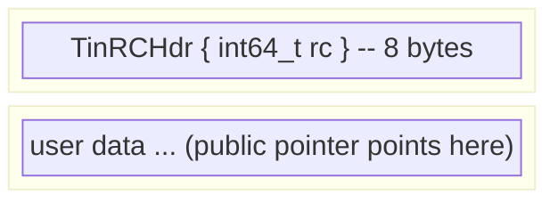

# Memory - ARC and Raw Allocation

## Overview

Tin uses **Automatic Reference Counting (ARC)** for heap-managed objects. Every
ARC block carries a small header immediately before its data. The compiler emits
`_tin_retain` and `_tin_release` calls at every point where a reference is
copied or goes out of scope.

Static string literals and other immortal objects opt out of ARC via a sentinel
value, eliminating all reference-counting overhead for compile-time data.

---

## `TinRCHdr` - the ARC header

```c
typedef struct { int64_t rc; } TinRCHdr;
#define TIN_IMMORTAL_RC ((int64_t)-1)
```

Every ARC-managed heap block is laid out as:



The **public pointer** (stored in `TinString.ptr`, `TinSlice.ptr`, struct
fields, etc.) points to the first byte of user data, not to the header.
The header is recovered by subtracting `sizeof(TinRCHdr)`:

```c
static inline TinRCHdr *_rc_hdr(void *ptr) {
    return (TinRCHdr *)((char *)ptr - sizeof(TinRCHdr));
}
```

### Reference count semantics

| `rc` value               | Meaning                                                                                                              |
|--------------------------|----------------------------------------------------------------------------------------------------------------------|
| `> 0`                    | Number of live references. `_tin_release` decrements; frees when it hits 0.                                          |
| `0`                      | No live references - the block is freed (no pointer should hold this state).                                         |
| `-1` (`TIN_IMMORTAL_RC`) | Immortal: never retained, never freed. Used for compile-time string literals and static data embedded in the binary. |

---

## `_tin_rc_alloc` - allocate an ARC block

```c
void *_tin_rc_alloc(int64_t size);
```

Allocates `sizeof(TinRCHdr) + size` bytes, initializes `rc = 1`, and returns
the public pointer (past the header). The caller owns one reference.

`_tin_rc_alloc` aborts with `"tin: out of memory"` on allocation failure rather
than returning NULL, so callers never need to check the return value.

---

## `_tin_retain` - increment reference count

```c
void _tin_retain(void *ptr);
```

Increments the reference count of the ARC block that `ptr` points into.

Skips:
- `NULL` - safe no-op.
- Blocks with `rc == TIN_IMMORTAL_RC` - immortal objects are never retained.

Called by the compiler whenever a reference is **copied** (assigned to a new
variable, passed to a function, stored in a struct field, etc.).

---

## `_tin_release` - decrement reference count and maybe free

```c
void _tin_release(void *ptr);
```

Decrements the reference count. When `rc` reaches zero, the entire block
(header + data) is freed with a single `free(hdr)`.

Skips:
- `NULL` - safe no-op.
- Immortal blocks - never freed.

Called by the compiler at every point a reference leaves scope or is
overwritten.

---

## Immortal sentinel

String literals in tin source (e.g. `"hello"`) are compiled into the binary as
global constants. Their memory layout mimics an ARC block:

```c
// Example for the string "hello"
static const struct {
    int64_t rc;          // TIN_IMMORTAL_RC = -1
    char    data[6];     // "hello\0"
} __str_hello = { -1, "hello" };
```

The `TinString.ptr` for this literal points to `__str_hello.data`, four bytes
past the `rc` field. `_tin_retain` and `_tin_release` see `rc == -1` and skip
the block entirely - no bookkeeping for static data.

---


## See also

- [ARC heap allocation + retain/release codegen rules](memory-arc-codegen.md)
- [Heap promotion + special-case releases](memory-special-cases.md)
