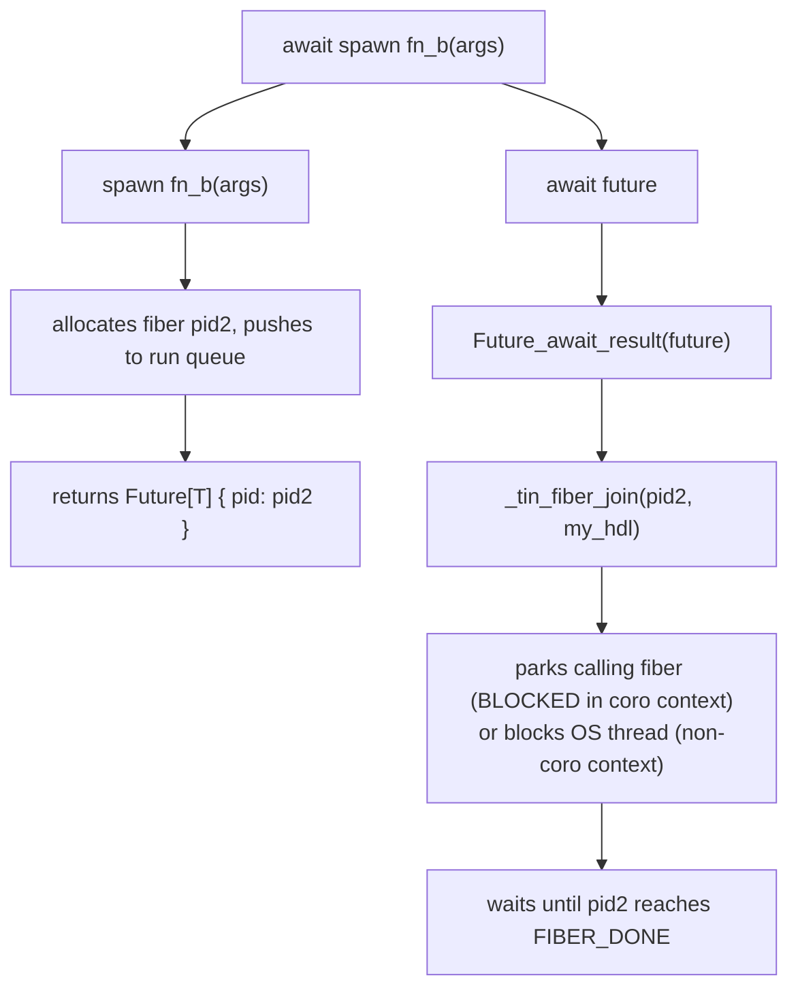

# Scheduler: park/unpark, I/O, timer, await spawn

## Park / Unpark Protocol

**Parking** (fiber blocks itself - e.g., I/O or sleep):

```c
void _tin_fiber_park(int64_t pid) {
    pthread_mutex_lock(&_table_mu);
    if (_fibers[pid]) _fibers[pid]->status = FIBER_BLOCKED;
    pthread_mutex_unlock(&_table_mu);
    // Fiber remains BLOCKED; worker will NOT re-enqueue on next check
}
```

**Unparking** (I/O thread or timer fires):

```c
void _tin_fiber_unpark(int64_t pid) {
    pthread_mutex_lock(&_table_mu);
    TinFiber *f = _fibers[pid];
    if (f && f->status == FIBER_BLOCKED) {
        f->status = FIBER_RUNNABLE;
        _run_queue_push(f);               // wake the fiber
    }
    pthread_mutex_unlock(&_table_mu);
}
```

---

## I/O Thread Wakeup

`runtime/async_io.c` runs a dedicated I/O thread that calls `epoll_wait`
(Linux) or `kevent` (macOS/FreeBSD) with a 5ms timeout.

The watch table is a heap-allocated `TinIOWatch[]` starting at 256 slots,
doubling up to `_io_watch_max` (default 64K, configurable via
`TINMAXIOWATCHES`). Exceeding the cap panics before the fiber is parked.

When `_tin_async_read` or `_tin_async_write` gets EAGAIN:
1. Sets fd to O_NONBLOCK.
2. Calls `_io_park(fd, outerPid, readFlag)` which:
   - Adds fd to the watch table (growing if needed, panicking if full).
   - Registers fd with epoll/kqueue (EPOLLONESHOT / EV_ONESHOT).
   - Calls `_tin_fiber_park(outerPid)` -> fiber status = BLOCKED.
3. Returns `TIN_IO_BLOCKED` sentinel (`INT64_MIN`).

When epoll/kqueue fires:
1. I/O thread calls `_tin_fiber_unpark(outerPid)`.
2. Fiber re-enters the run queue as RUNNABLE.
3. Worker resumes the fiber's drive loop.
4. Drive loop resumes the inner `async_read$coro`.
5. Inner coro retries the read; it succeeds (or gets EAGAIN again).

---

## Timer Thread Wakeup

`runtime/timer.c` runs a timer thread that polls every 1ms.

The timer table is a heap-allocated `TinTimer[]` starting at 1024 slots,
doubling up to `_timer_max` (default 1M, configurable via `TINMAXTIMERS`).
The fiber is parked **before** the table is grown; if the table is full,
`_tin_panic` is called after releasing the mutex.

When `io::sleep(ms)` is called:
1. `_tin_sleep_ms(ms)` in C parks the fiber: `_tin_fiber_park(pid)`.
2. Grows the timer table if needed, panics if at cap.
3. Appends `TinTimer{deadline, pid}` to the table.
4. Timer thread wakes -> finds expired entries -> calls `_tin_fiber_unpark(pid)`.

---

## Fiber Struct Pool

### Motivation

Each spawned fiber requires a heap-allocated `TinFiber` struct (one embedded
`pthread_mutex_t` + one `pthread_cond_t`, plus data fields). Calling `calloc` /
`pthread_mutex_init` / `pthread_cond_init` on every spawn and their inverses on
every reclaim is expensive under burst workloads that create thousands of
short-lived fibers.

The fiber struct pool keeps destroyed-but-clean `TinFiber` structs alive after
reclaim so the next spawn can take one from the pool instead of allocating fresh.

### Pool layout

```c
#define FIBER_POOL_MAX      4096
#define POOL_DECAY_INTERVAL  256

static TinFiber *_fiber_pool[FIBER_POOL_MAX];  // ready-to-reuse structs
static int64_t   _fiber_pool_cnt = 0;          // pool occupancy
static int64_t   _live_cnt       = 0;          // live (not-yet-reclaimed) fibers
static int64_t   _live_peak      = 0;          // high-water mark of _live_cnt
static int64_t   _reclaim_total  = 0;          // total reclaims (decay clock)
```

All globals are protected by `_table_mu`.

### Reclaim path - `_fiber_struct_reclaim(f)`

Called (under `_table_mu`) whenever a fiber is freed - both ff-reclaim and
`_tin_fiber_get_result`. Three steps:

1. **Decrement `_live_cnt`** and increment `_reclaim_total`.
2. **Interval decay**: every `POOL_DECAY_INTERVAL` reclaims, halve the excess
   capacity: `live_peak = (live_peak + live_cnt) / 2`. Trim `_fiber_pool` to
   the new peak, destroying and freeing any structs beyond it.
3. **Idle-transition decay**: when `live_cnt` drops to 1 (only the main fiber
   is still running - end of every batch), apply one additional halving step.
   This fires once per batch-end regardless of reclaim count, so the pool
   converges toward actual sustained load even when individual batches are too
   small to accumulate `POOL_DECAY_INTERVAL` reclaims.
4. **Pool or free**: if `_fiber_pool_cnt < FIBER_POOL_MAX`, save/restore the
   `done_mu` and `done_cv` fields, `memset` all other fields to zero, and push
   the struct onto the pool. Otherwise destroy mutex/cond and `free`.

The mutex and condvar are **not** destroyed when pooling - they remain valid and
re-usable, avoiding repeated init/destroy costs.

### Spawn path - `_spawn_impl`

```c
TinFiber *f;
if (_fiber_pool_cnt > 0) {
    f = _fiber_pool[--_fiber_pool_cnt];   // already zeroed, mutex/cond live
} else {
    f = calloc(1, sizeof(TinFiber));
    pthread_mutex_init(&f->done_mu, NULL);
    pthread_cond_init(&f->done_cv,  NULL);
}
f->pid = pid; f->hdl = hdl; f->status = FIBER_RUNNABLE; f->prejoined = prejoined;
_live_cnt++;
if (_live_cnt > _live_peak) _live_peak = _live_cnt;   // track high-water mark
```

### Decay behaviour

- **Burst**: during a burst that peaks at N fibers, `_live_peak` grows to N. As
  fibers complete, the interval decay fires every 256 reclaims, stepping
  `_live_peak` down toward the current live count. By the end of the burst the
  pool holds roughly as many structs as were in flight near the tail.
- **Calm period**: each batch end (idle-transition decay) halves the surplus.
  After log2(peak/sustained_load) calm periods the pool converges to ~1-2x the
  sustained load.
- **Shutdown**: `_tin_fiber_run` drains the pool unconditionally, destroying
  mutex/cond and freeing all pooled structs.

Example trace (2001-fiber burst followed by batches of 10, 200, 5):

```
new-peak  live=2001 peak=2001 pool=0/4096
decay     live=721  peak=1217->969   pool=969  trimmed=310   # every 256 reclaims
...
idle      live=1    peak=463->232    pool=232  trimmed=439   # batch end
idle      live=1    peak=232->116    pool=116  trimmed=116
idle      live=1    peak=116->58     pool=58   trimmed=58
idle      live=1    peak=58->29      pool=29   trimmed=29    # 4 idle steps
...                                                          # (2x spawn_batch + 2x sleep fiber)
idle      live=1    peak=183->92     pool=92   trimmed=107
idle      live=1    peak=46->23      pool=23   trimmed=23    # final pool = 23
```

The pool shrinks from 2001 to 23 over the full sequence - no manual tuning needed.

### Debug flag

Compile with `-fdebug-fiber-slots` (or `-DTIN_DEBUG_FIBER_SLOTS=1` directly)
to print pool events to stderr:

```
[fiber-slots] new-peak  live=N peak=N pool=M/4096   # live count exceeds previous peak
[fiber-slots] decay     live=N peak=A->B pool=M trimmed=T  # interval decay step
[fiber-slots] idle      live=N peak=A->B pool=M trimmed=T  # idle-transition step
[fiber-slots] pool-full live=N peak=N pool=4096/4096       # pool at cap, struct freed
```

Per-spawn and per-reclaim events are suppressed - only state changes that affect
pool size are logged.

---

## Fire-and-Forget Reclaim

Fibers with no registered waiters at completion are **fire-and-forget (ff)**
fibers: nobody will call `_tin_fiber_join` or `_tin_fiber_get_result`, so
their slot can be freed immediately. Without reclaim, long-running programs
that spawn many short-lived fire-and-forget fibers would exhaust the table.

### How it works

At completion (under `_table_mu`), before `_fire_done_waiters` resets `waiter_cnt`:

```c
int had_waiters = (f->waiter_cnt > 0)   // in-fiber join registered
               || (f->os_waiter_cnt > 0) // OS thread blocking on done_cv
               || f->prejoined;          // spawner will call _tin_fiber_join

_fire_done_waiters(f);
// ... broadcast done_cv ...

if (!had_waiters && !f->panic_msg) {
    free(f->result);
    f->result = NULL;
    if (_free_slot_push(f->pid))      // adds pid to free list, sets _fibers[pid]=NULL
        _fiber_struct_reclaim(f);     // pool or free the TinFiber struct
}
```

Panicking ff fibers are NOT reclaimed here: `panic_msg` must remain readable by
`_tin_fiber_check_panic` until shutdown (see [fiber-panic.md](fiber-panic.md)).

### Slot reuse via `_free_slots`

Reclaimed pids are pushed onto a `_free_slots` free list (a resizable array,
also protected by `_table_mu`). `_tin_fiber_spawn` / `_tin_fiber_spawn_joinable`
prefer a free-list entry over incrementing `_fiber_cnt`, so total slot usage
is bounded by the peak concurrent fiber count rather than the total spawned.

`_tin_fiber_get_result` also reclaims the slot after the caller reads the result
(i.e., for awaited fibers that were not ff-reclaimed):

```c
void *_tin_fiber_get_result(int64_t pid) {
    // _table_mu held
    TinFiber *f = _fibers[pid];
    void *r = f->result;
    f->result = NULL;
    if (_free_slot_push(pid))
        _fiber_struct_reclaim(f);   // pool or free
    // release _table_mu
    return r;
}
```

Must be called at most once per pid (after `_tin_fiber_join` + panic check).

### `prejoined` flag

Spawns from non-coroutine context (`_tin_fiber_spawn_joinable`) set
`f->prejoined = 1` inside `_table_mu` before pushing to the run queue.
This blocks ff_reclaim for the fiber's entire lifetime, preventing the TOCTOU
race between `_tin_fiber_spawn_joinable` returning a pid and the caller later
calling `_tin_fiber_join`.

`os_waiter_cnt` is separate: it counts OS threads currently blocking on
`done_cv` (0 when none are waiting). `prejoined` is a spawn-time declaration
("the spawner will join"), while `os_waiter_cnt` is a live counter during the
actual blocking wait. Both are set/read under `_table_mu`.

---

## await spawn - Fiber Join

`await spawn fn_b(args)` runs an async function as a fiber and blocks until it
completes:

1. `spawn fn_b(args)` starts a new fiber (pid2) and returns `Future[T]`.
2. `await future` evaluates `future` (which implements `Awaitable[T]`) and
   calls `Future_await_result(future)` -> `_tin_fiber_join(pid2)`.



There is **no inline drive loop** - the inner fiber runs independently on any
worker thread. The calling fiber parks (or the OS thread blocks) until done.

### Spawn variants

| Function | `prejoined` | Used by |
|---|---|---|
| `_tin_fiber_spawn` | 0 | statement-level `spawn` whose result is discarded (fire-and-forget) |
| `_tin_fiber_spawn_joinable` | 1 | all other spawns: stored futures, coro-context spawns, main coro |

Both share `_spawn_impl`; the only difference is the `prejoined` argument.

`prejoined=1` ensures the fiber's slot cannot be ff-reclaimed between the spawn
and the caller's `await`. Without it, a fiber that completes before `await` is
reached could have its pid reused, causing the join to target the wrong fiber.

The codegen sets `spawnFireForget=true` only for `ExprStmt`-wrapped `SpawnExpr`
nodes (the result is explicitly discarded). All other spawn sites - including
spawns inside coroutine bodies whose result is stored - use `spawn_joinable`.

### _tin_fiber_join

Two paths depending on the calling context:

**In-fiber path (called from a coroutine on a worker thread):**

```c
// Register calling fiber as a waiter; defer blocking via pending_join.
target->waiters[target->waiter_cnt++] = my_pid;
me->pending_join = 1;
pthread_mutex_unlock(&_table_mu);
// coro.suspend fires after this call; worker sets BLOCKED if not yet done.
```

When `target` completes, `_fire_done_waiters` wakes each registered waiter by
calling `_enqueue_waiter(wpid, w)` -> RUNNABLE.

**OS-thread path (called from non-coro context, e.g. test body or sync main):**

```c
target->os_waiter_cnt++;          // prevents done_mu/done_cv destruction
pthread_mutex_lock(&target->done_mu);
pthread_mutex_unlock(&_table_mu);
while (target->status != FIBER_DONE)
    pthread_cond_wait(&target->done_cv, &target->done_mu);
pthread_mutex_unlock(&target->done_mu);
// Decrement os_waiter_cnt now that done_mu is released.
```

`prejoined=1` (set by `spawn_joinable`) ensures `_fibers[pid]` is still valid
when this path runs, even if the target completed before `_tin_fiber_join` was
reached.

After join, generated code calls `_tin_fiber_get_panic_msg` then (if no panic)
`_tin_fiber_get_result`, which reclaims the fiber slot.

### `await` requires `Awaitable[T]`

The `await` guard checks only the **type** of the expression - any
`Awaitable[T]` value can be awaited, regardless of how it was produced:

```rust
// All valid - expression evaluates to Awaitable[T]:
await spawn fn_b(args)       // spawn returns Future[T]
let f = spawn fn_b(args)
await f                      // f is Future[T]
await fetch()                // fetch() returns Future[T] directly (wraps spawn internally)
await io::sleep(500)         // io::sleep returns Future[Unit] directly
await ioutil::read_string(conn) // returns Future[string] directly

// INVALID - fn_b is {#async}: fn_b(args) calls the sync variant, returns T not Awaitable[T]:
await fn_b(args)             // compile error if fn_b is {#async}
```

Many stdlib functions (`io::sleep`, `io::write_all`, `ioutil::read_string`,
`tcp::Conn.read`, etc.) return `Future[T]` directly and can be awaited without
`spawn`. Low-level primitives (`io::async_read`, `io::async_write`) are
`{#async}` functions that must be called with `await spawn`.

---

